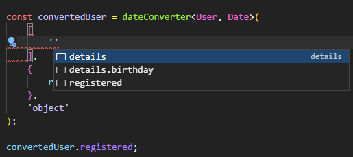

# Typed Date Converter


## Well, what is it?

It is an attempt to create an approach for converting primitive dates (numbers/strings) into object types (Date, Moment, etc.) for typescript, without the need to describe them in a separate interface.
For example you get from api:
```typescript
interface User {
    registered: string;
    details: {
        birthday: string;
    };
}
```

but in the application you need the convert the registered field to `Date`. What now? Create a new interface with this type, or modify existing one for using generic? This is the problem this package tries to tackle: convert all dates from one type to another and return a new typed entity without the need to manually create new interfaces.

## Well, how to use it?

First of all, the interface used for converting should be turned into a 'super' interface, to include all possible date types, this is required for proper converted result typings. Let's assume the `registered` field of the `User` can be primitive `string` or object `Date`:

```typescript
interface User {
    registered: string | Date;
    details: {
        birthday: string | Date;
    };
}
```

As the package does not perform conversions itself, it requires you to provide two function: one for converting object date to primitive and the other one doing vice versa.

In our case let's assume the date as primitive always comes as YYYY-MM-DD and we can throw it into `Date` constructor, so the functions would look like this:

```typescript
const convertToDate = (s: string) => new Date(s);
const convertToString = (s: Date) => s.toISOString();
```

Now we can create our date converter for `Date` and `string` types:
```typescript
const dateConverter = dateConverterFactory<Date, string>(convertToDate, convertToString);
```

Next we call it, passing 
* two types, the interface we use for conversion and the date type we want to be produced;
* string paths to date fields for conversion (there is intellisense for them), one path or array of values is supported, your job is to point to the right fields for conversion, they can't be determined automatically;
  
* explicit flag of conversion type, either `object` or `primitive`, there's a type check for it, can't pass the wrong one.

```typescript
const convertedUser = dateConverter<User, Date>(
    'registered',
    {
        registered: '1970-12-12',
    },
    'object'
);
```
